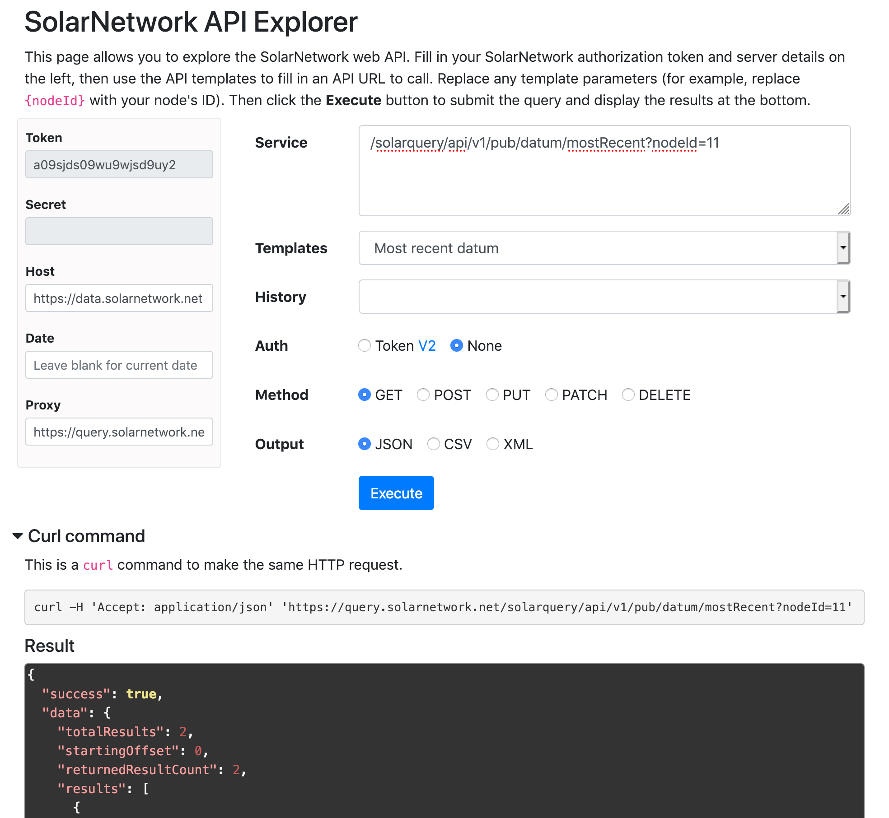

# SolarNetwork Web API Explorer

This project contains a webapp that helps you explore the SolarNetwork web API. A live version of this is available here: https://go.solarnetwork.net/dev/api/



# Use

Fill in a valid SolarNetwork security token and secret, then start exploring!

# Building from source

To build yourself, clone or download this repository. You need to have
Node 18.18+ installed. Then:

```sh
# initialize dependencies
npm ci

# run development live server on http://localhost:8080
npm run dev

# build for production
npm run build
```

Running the `build` script will generate the application into the `dist/` directory.

[npm]: https://www.npmjs.com/
