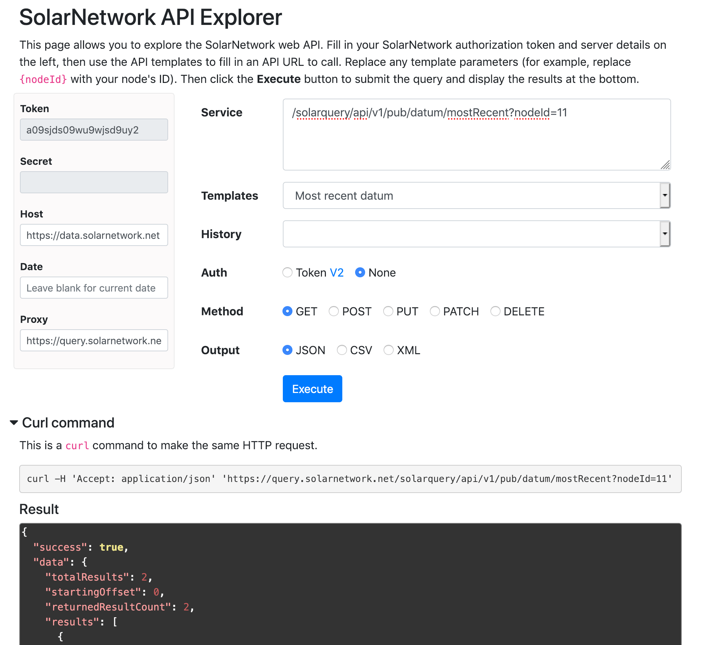

# SolarNetwork Web API Explorer

This project contains a webapp that helps you explore the SolarNetwork web API. A live version of this is available here: https://go.solarnetwork.net/dev/api/



# Use

Fill in a valid SolarNetwork security token and secret, then start exploring! The API documentation is availalbe here:https://github.com/SolarNetwork/solarnetwork/wiki/SolarQuery-API

# Building from source

To build yourself, clone or download this repository. You need to have
Node 24+ installed. Then:

```sh
# initialize dependencies
npm ci

# run development live server on http://localhost:8080
npm run dev

# build for production
npm run build
```

Running the `build` script will generate the application into the `dist/` directory.

# Releases

Releases are done using the gitflow branching model. [git-flow][git-flow] must be installed on your
host system. Then you can run

```sh
npm run release
```

to version, build, and commit the release. The release is orchestrated by [release-it][release-it],
configured in `.release-it.json`: it starts a `release/X.Y.Z` branch, writes the new version, builds
the application into `dist/`, commits, then hands off to `git flow release finish` to merge into
`master`, tag, merge back into `develop`, and push. Finally it bumps `develop` to the next `-dev.0`
version. Release commits and tags are GPG signed.

Nothing is published: once the release finishes, `dist/` holds the release build, ready to copy to
the web server. Copy it before running another build, which would replace it with a development
version.

Pass `--dry-run` to see every step without changing anything:

```sh
npm run release -- --dry-run
```

The version to release is derived from the current `-dev.0` version in `package.json`; use
`--increment minor` or `--increment major` (or pick from the prompt) for a non-patch release.

[git-flow]: https://github.com/gittower/git-flow-next
[npm]: https://www.npmjs.com/
[release-it]: https://github.com/release-it/release-it
